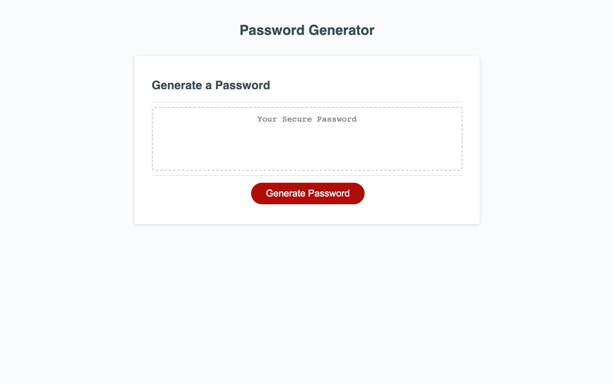

Title: Password-Generator

Description: A tool for randomizing and generating a new password that fits a user driven criteria. This application lets you choose the length of your password, to include uppercase letters, to include lowercase letters, to include numbers, and to include special characters. I faced difficulty in trying to learn and differentiate when you should use var or let or const through trial and error. Had to work through whether to use a for loop or while loop, but ultimately decided on the while loop and got it working.

How to Use: Open up the page in the web browser click on Generate Password and go through the series of prompts and confirms to pick the criteria you would like to have in your new random and secure password. The password must be between 8 and 128 characters and must satisfy at least one of the confirm criteria after that.

License:N/A

Link: https://nporter619.github.io/Password-Generator/

Screenshot:
